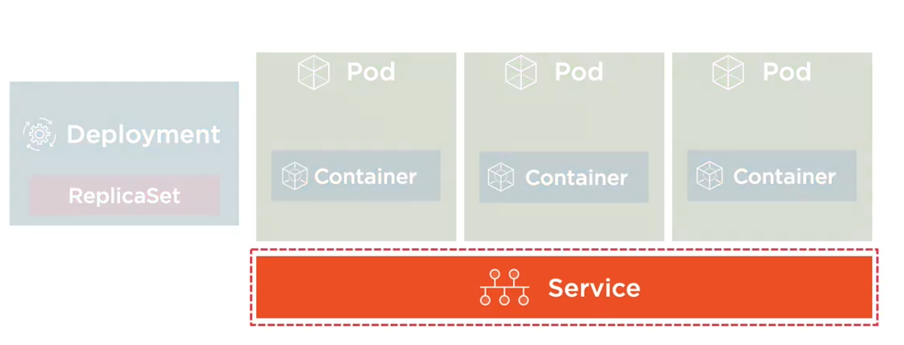

Service provides a single point of entry for accessing one or more Pods.
Pods live and die, we can't rely on their IP, thus we need services. Services abstract Pod IP addresses from consumers.
- Service knows how to load balance
- Relies on labels to associate a Service with a Pod
- Node's kube-proxy creates a vritual IP for Services
- Services are not ephemeral

Pods and services are joined together using label and selector.


Services types:
- ClusterIP - Expose the service on a cluster-internal IP (Default). Only Pods within the cluster can talk to the Service. Allows Pods to to talk to other pods. Example: FE talks with BE.
- NodePort - Expose the service on each node's IP at a static port (default is 30000 - 32767). Debugging reasons.
- LoadBalander - Provision an external IP to act as load balancer for the service. 
- ExternalName - Maps a service to a DNS name. Acts as an alias for an external service. External details are hidden from cluster (easier to change).

Example of clusterIP Service;
```yaml
apiVersion: v1
kind: Service
metadata:
    name: nginx # each service gets a dns entry
    labels: 
        app: nging
spec: 
    selector:
        app: nginx # Service will apply to resources with a label of app: nginx
    ports: 
    - name: http
      port: 80
      targetPort: 80
```

Example of NodePort Service;
```yaml
apiVersion: v1
kind: Service
metadata:
    name: nginx 
    labels: 
        app: nging
spec: 
    type: NodePort
    selector:
        app: nginx 
    ports: 
    - name: http
      port: 80
      targetPort: 80
      nodePort: 31000
```

Example of LoadBalancer Service;
```yaml
apiVersion: apps/v1
kind: Deployment
metadata:
  name: my-nginx
  labels:
    app: my-nginx
spec:
  selector:
    matchLabels:
      app: my-nginx
  template:
    metadata:
      labels:
        app: my-nginx
    spec:
      containers:
      - name: my-nginx
        image: nginx:alpine
        ports:
        - containerPort: 80
        resources: {}
```
```yaml
apiVersion: v1
kind: Service
metadata:
 name: nginx-loadbalancer
spec:
 type: LoadBalancer
 selector:
    app: my-nginx
 ports:
  - name: "80"
    port: 80
    targetPort: 80
```

Example of ExternalName Service;
```yaml
apiVersion: v1
kind: Service
metadata:
    name: external-service 
spec: 
    type: ExternalName
    ports: 
    - port: 9000
```

## How to test if a Service and Pod is working?
Shell into a Pod and test a URL. 

`kubectl exec [pod-name] -- curl -s http://podIP`

if curl is not there (alpine linux)

`kubectl exec [pod-name] -t sh`

`apk add curl`

`curl -s http://podIP`