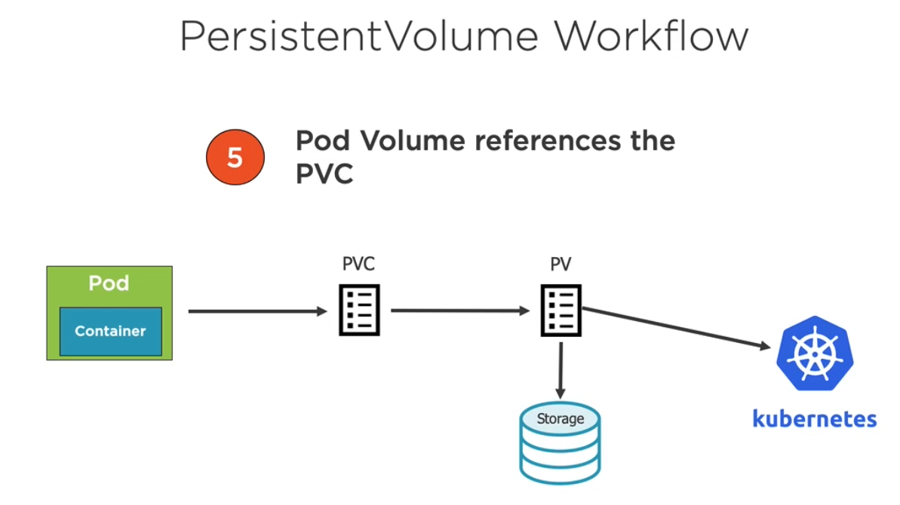
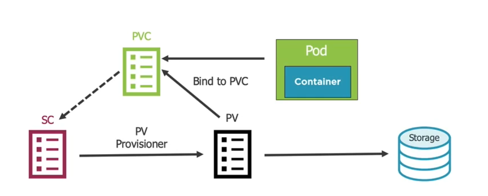

# Volume
- References a storage location
- Must have unique name
- Attached to a Pod and may or may not to be tied to the Pod's lifetime (depending on volume type).
- A Volume mount references a volume by name and defines a mountPath.

Volumes:
- EmptyDir - example in [6_storage_emptydir](./6_storage_emptydir.yml)
- HosPath (ties to host)
    - DirectoryOrCrate
    - Directory
    - File
    - FileOrCreate
    - Socket (ie Docker)
    - CharDevice
    - BlockDevice
- PersistentVolume: is a cluster-wide storage unit provisioned by an administrator with a lifecycle independent from a Pod.
    - PersistendVolumeClaim is a request for a storage unit. (admin creates persisted volume, devs in yaml files use PVC so they can talk to the PV).

## StorageClass (SC)
is a type of storage template that can be used to dynamically provision storage.
* Supports dynamic provisioning of PresistentVolumes - Administrator sets up storage class, we can than request through PVC a volume. Administrators don't have to create PVs in advance.
* Workflow:
    
    1. Create StorageClass
    2. Create PVC that references StorageClass
    3. Kubernetes uses StorageClass provisioner to provision a PresistentVolume. 
    4. Sotrage provisioned, PersistentVolume created and bound to PVC.
    5. Pod volume references PresistedVolume claim (PVC).

Example to set this up with postgres:
https://medium.com/@xcoulon/storing-data-into-persistent-volumes-on-kubernetes-fb155da16666

https://github.com/kubernetes/examples